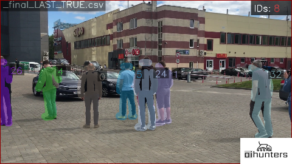
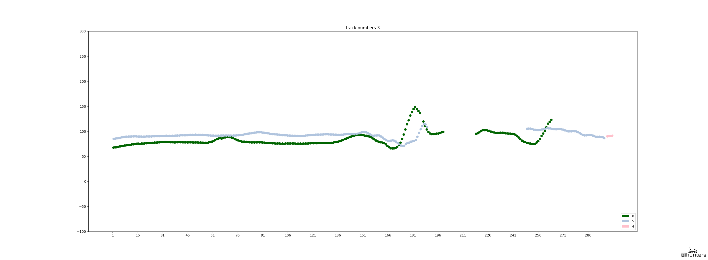

### AcurusTrack. Python data association component for precise multi-object tracking
AcurusTrack is a highly predictable multiple object tracker. It is based on a custom data association approach.

This component does not depend on objects' nature - we work with arbitrary ones.  You can serve any metadata as input. Here we display the examples of the metadata derived by face and pose estimators. You can use any of the estimators you prefer to create the data for input. 

This repository is a work of AIHunters. 

We got inspired by the article describing the Markov chain Monte Carlo data association. For fairly simple cases we're releasing this slightly shorter version. But if you are interested in a full version, or have business cases for any of the two versions, feel free to contact us at oss@aihunters.com for more information.

### Pipeline conceptual representation 
 

### Use Cases
* Complicated multi-occlusion movement 

    
* Medical face masks 

    
* Identically-dressed people with faces fully covered

    
* People in identical military uniform

    
* Visitor analytics for physical locations

    
* Feel free to suggest yours
    
### First Time Setup:


```
git clone https://github.com/AIHunters/AcurusTrack.git
cd AcurusTrack
sudo apt-get install python-virtualenv
virtualenv venv --system-site-packages
source venv/bin/activate
pip install -r requirements.txt
```

### Enter the virtualenv in a later session to use the installed libraries
```
source venv/bin/activate
```

### To exit the virtualenv
```
deactivate
```


Input data should have the following form:

```json5
{"frame_no": [{"x1": top_right_x, "y1": top_right_y, "x2": bottom_left_x, "y2": bottom_left_y}], "frame_no":[],...}
```

in case of face processing (for face meta extraction we used RetinaFace)

```json5
{"frame_no": [{"body_part_name_x": x_coord, "body_part_name_y": y_coord, "body_part_name_x": x_coord, "body_part_name_y": y_coord}], "frame_no":[],...}
```

in case of body processing (for pose meta extraction we used OpenPose, and you can use any pose estimator you want).
More information about the parameters you can find in config.py

### Clean the data


To enhance accuracy, we recommend using the [EvenVizion](https://github.com/AIHunters/EvenVizion) component which allows transfer to a fixed coordinate system.
If you choose to use it:

* navigate to the FCS;
* create a separate environment for the EvenVizion setup;
* use run_EvenVizion.py to get json with with homography matrices;
* run AcurusTrack, setting fixed_coordinate_system = True beforehand.


### Project structure (main files):

* [run.py](run.py) - main file for running algorithm
* [pipeline.py](pipeline.py) - pipeline, including splitting video on chunks, processing them individually, merging results, running final merge algorithm
* [config.py](config.py)  - parameters that define overall pipeline
* [FCS](FCS) 
    * [run_EvenVizion.py](FCS/run_EvenVizion.py) - moving to fixed coordinate system
    *  [fixed_coordinate_system.py](FCS/fixed_coordinate_system.py) 
*  [processing](processing) 
*  [track](track)
    * [tracker.py](track/tracker.py) - contain abstract class AbstractTracker, realizing full pipeline.
    * [tracker_merger.py](track/tracker_merger.py) - contain class TrackerMerger for simplified pipeline.
*  [initialisation](initialisation)  - meta preprocessing based on some similarity metric
    *  [initialisation.py](initialisation/initialisation.py) - universal preprocessing scheme
    *  [face.py](initialisation/face.py) - preprocessing scheme for face meta 
    *  [pose.py](initialisation/pose.py) - preprocessing scheme for pose meta 
*  [additional](additional)  - auxiliary file with modified Kalman filter.
*  [utils](utils)  - custom useful functions
*  [examples](examples) - demo scripts 
*  [visualization](visualization)  - folder containing all visualization functions
    * make_video_with_meta.py - visualize algorithm result
        * using face meta
        
        
        * using pose meta
        
        
    
    * visualization.py - functions for custom meta visualization
    
    

###  Run the analysis

```
$python3 run.py --detections [json containing detections] --video_path --video_name --exp_name --path_to_homography_dict optionally --start_frame optionlly --end_frame optionally
```

### Accuracy comparison

We decided to compare our AcurusTrack component (right) with one of the popular trackers - Re3 (left).

* Identically-dressed people with faces fully covered

     
* Medical face masks 

     


As you can see, the accuracy is higher when using AcurusTrack (especially in the presence of occlusions and camera movement).

### Important notice

- Please NOTE that we have changed a souce code of the filterpy library slightly, you can find it at the repository.
- Pay close attention to the configureable parameters as they include important control features. 


### Latest updates

Single-shot multi-object tracking was added in the latest release AS AN EXPERIMENT. You can try using it for your cases. 


### License 
AcurusTrack is licensed under the GNU General Public License, either version 3 of the License, or (at your option) any later version.
All the third-party open-source software used in this project is listed in Third-Party Open Source Software Notice together with the according licenses. 

https://github.com/AIHunters/AcurusTrack


### Send us your feedback

We're open to any kind of communication, whether it is your feedback, failure cases,
 possible improvements or cooperation possibilities. Contact us at oss@aihunters.com. 

Please adhere to our CODE_OF_CONDUCT to keep positive and constructive environment here. 
